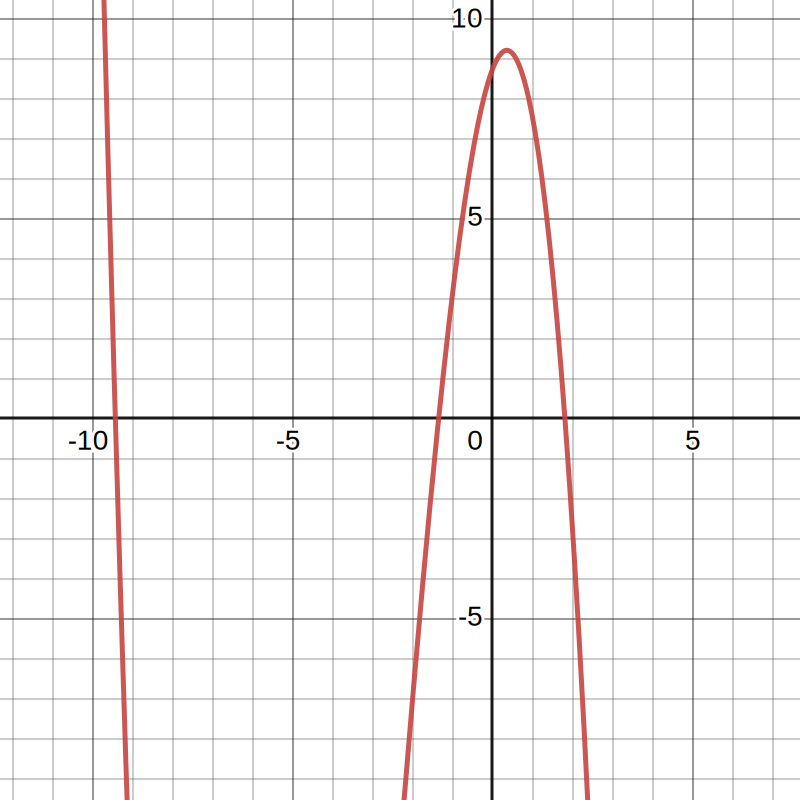

# Лабораторная работа 2: Решение нелинейных уравнений

## Введение

|         |     |
| ------- | --- |
| Вариант | 17  |

## Вычислительная часть

|           |                                                              |
| --------- | ------------------------------------------------------------ |
| Уравнение | $-0.38 \cdot x ^ 3 - 3.42 \cdot x ^ 2 + 2.51 \cdot x + 8.75$ |
| Методы    | Половинного деления, Простой итерации, Секущих               |
| Интервалы | [-10, -9], [-1.4, -1.2], [1.6, 1.8]                          |
| Корни     | -9.441, -1.357, 1.798                                        |

График функции на заданном интервале:


Таблица 1: Метод итерации на отрезке [-10, -9]

| n   | a     | b     | x     | f(a)    | f(b)    | f(x)    | b - a    |
| --- | ----- | ----- | ----- | ------- | ------- | ------- | -------- |
| 1   | -9.5  | -9    | -9.25 | 2.05    | -13.8   | -6.34   | 0.5      |
| 2   | -9.5  | -9.25 | -9.38 | 2.05    | -6.34   | -2.26   | 0.25     |
| 3   | -9.5  | -9.38 | -9.44 | 2.05    | -2.26   | -0.131  | 0.125    |
| 4   | -9.5  | -9.44 | -9.47 | 2.05    | -0.131  | 0.954   | 0.0625   |
| 5   | -9.47 | -9.44 | -9.45 | 0.954   | -0.131  | 0.41    | 0.0312   |
| 6   | -9.45 | -9.44 | -9.45 | 0.41    | -0.131  | 0.139   | 0.0156   |
| 7   | -9.45 | -9.44 | -9.44 | 0.139   | -0.131  | 0.00394 | 0.00781  |
| 8   | -9.44 | -9.44 | -9.44 | 0.00394 | -0.131  | -0.0635 | 0.00391  |
| 9   | -9.44 | -9.44 | -9.44 | 0.00394 | -0.0635 | -0.0298 | 0.00195  |
| 10  | -9.44 | -9.44 | -9.44 | 0.00394 | -0.0298 | -0.0129 | 0.000977 |

Таблица 2: Метод простой итерации на отрезке [-2, -1]

| n   | prev  | next  | f(next) | b - a   |
| --- | ----- | ----- | ------- | ------- |
| 1   | -2    | -1.41 | -1.36   | 0.594   |
| 2   | -1.41 | -1.36 | -1.36   | 0.0415  |
| 3   | -1.36 | -1.36 | -1.36   | 0.00653 |
| 4   | -1.36 | -1.36 | -1.36   | 0.00108 |
| 5   | -1.36 | -1.36 | -1.36   | 0.00018 |

Таблица 3: Метод Ньютона на отрезке [1, 2]

| n   | x    | fx       | dfx   | y    | diff     |
| --- | ---- | -------- | ----- | ---- | -------- |
| 1   | 2    | -2.93    | -15.7 | 1.81 | 0.187    |
| 2   | 1.81 | -0.196   | -13.6 | 1.8  | 0.0144   |
| 3   | 1.8  | -0.00113 | -13.5 | 1.8  | 8.42e-05 |

## Програмная часть


### Метод половинного деления
```c++
  T findSomeRoot(Interval<T> scope, Function<T> f) {
    assert(isDefinitelyRootInside(scope, f));

    while (true) {
      auto left = scope.leftFrom(scope.middle());
      auto right = scope.rightFrom(scope.middle());

      if (isDefinitelyRootInside(left, f)) {
        scope = left;
      } else {
        scope = right;
      }

      if (scope.length() < epsilon) {
        break;
      }
    };

    return scope.middle();
  }
```

### Метод Ньютона

```c++
  bool accepts(
      Interval<T> scope,
      Function<Real> f,
      Function<Real> df,
      Function<Real> ddf
  ) {
    return isDefinitelyRootInside(scope, f)
           && constSign(scope, 0.0001, df)
           && constSign(scope, 0.0001, ddf);
  }

  T findSomeRoot(
      Interval<T> scope,
      Function<Real> f,
      Function<Real> df,
      Function<Real> ddf
  ) {
    assert(accepts(scope, f, df, ddf));

    auto prev = (                                 
        (f(scope.left() * ddf(scope.left())) > 0) 
            ? (scope.left() + epsilon)
            : (scope.right() - epsilon)
    );

    while (true) {
      assert(df(prev) != 0);

      auto next = prev - f(prev) / df(prev);

      if (std::abs(next - prev) < epsilon) {
        break;
      }

      prev = next;
    }

    return prev;
  }
```

### Метод простой итерации
```c++
bool accepts(Interval<T> scope, const Function<T>& dphi) {
    auto absmax = max<T>(scope, 0.0001, [&dphi](T x) { 
        return std::abs(dphi(x)); 
    });
    return absmax < 1;
  }

  T findSomeRoot(T prev, const Function<T>& phi) {

    auto next = phi(prev);
    for (int i = 0; i < 100; i++) {

      if (std::abs(next - prev) < epsilon) {
        break;
      }

      prev = next;
      next = phi(next);
    }

    return next;
  }
```

## Пример работы программы
```bash
$ ./build/math-tool eqsolver newton -5 5 0.01
1
Report
Taken method: Newton
Scope: [-5.000000, 5.000000]
Accuracy: 0.01
Graph: 
                                        |                      +                
                                                                                
                                                                                
                                                                                
                                                                                
                                                                                
                                                                                
                                                                                
                                                                                
                                                                                
                                        |                     +                 
                                                                                
                                                                                
                                                                                
                                                                                
                                                                                
                                                                                
                                                                                
                                                                                
                                                                                
                                        |                    +                  
                                                                                
                                                                                
                                                                                
                                                                                
                                                                                
                                                                                
                                                                                
                                                                                
                                        |                   +                   
                                                                                
                                                                                
                                                                                
                                                                                
                                                                                
                                                                                
                                                                                
                                        |                   +                   
                                                                                
                                                                                
                                                                                
                                                                                
                                                                                
                                                                                
                                                                                
                                        |                  +                    
                                                                                
                                                                                
                                                                                
                                                                                
                  ++++                  |                                       
                 +    +                 |                                       
                +      +                |                 +                     
                       +                |                                       
               +        +               |                                       
                         +              |                                       
               +                        |                                       
-------------{+-}-------{-}-------------|---------------{+}---------------------
                           +            |                                       
                                                                                
             +             +            |                                       
                                                                                
                            +           |                                       
            +                           |               +                       
                             +          |                                       
                                                                                
                              +         |                                       
           +                            |                                       
                               +        |                                       
                                        |               +                       
                                                                                
           +                   +        |                                       
                                                                                
                                +       |              +                        
                                                                                
          +                      +      |                                       
                                                                                
                                                                                
                                  +     |             +                         
                                                                                
         +                         +    |                                       
                                                                                
                                   +    |            +                          
                                                                                
                                    +   |                                       
                                        |           +                           
        +                            +  |                                       
                                                                                
                                      + |          +                            
                                                                                
                                       +|                                       
                                        |          +                            
       +                               +|                                       
                                        |         +                             
                                                                                
                                        |+       +                              
                                        | +     +                               
                                        |  +   +                                
                                        |  +++++                                
       +                                |                                       
                                                                                
                                                                                
                                                                                
                                                                                
                                                                                
                                                                                
      +                                 |                                       
                                                                                
                                                                                
                                                                                
                                                                                
                                                                                
                                                                                
                                                                                
     +                                  |                                       
Scope: [-3.333333, -3.000000]
| n | a | b | x | f(a) | f(b) | f(x) | b - a |
|---|---|---|---|------|------|------|-------|
|1|-3.33333|-3.16667|-3.25|-1.43037|0.0903704|-0.620625|0.166667|
|2|-3.25|-3.16667|-3.20833|-0.620625|0.0903704|-0.253001|0.0833333|
|3|-3.20833|-3.16667|-3.1875|-0.253001|0.0903704|-0.0783105|0.0416667|
|4|-3.1875|-3.16667|-3.17708|-0.0783105|0.0903704|0.00677766|0.0208333|
|5|-3.1875|-3.17708|-3.18229|-0.0783105|0.00677766|-0.0355791|0.0104167|
|6|-3.18229|-3.17708|-3.17969|-0.0355791|0.00677766|-0.0143539|0.00520833|
HalfDivision result is -3.17969
| n | x | fx | dfx | y | diff |
|---|---|----|-----|---|------|
|1|-3.32333|-1.32787|10.1764|-3.19285|0.130486|
|2|-3.19285|-0.122574|8.31452|-3.17811|0.0147421|
|3|-3.17811|-0.00150373|8.11059|-3.17792|0.000185403|
Newton result is -3.17811
| n | prev | next | f(next) | b - a |
|---|------|------|---------|-------|
|1|-3.33333|-3.19478|-3.18135|0.138558|
|2|-3.19478|-3.18135|-3.17865|0.0134288|
|3|-3.18135|-3.17865|-3.17808|0.0026992|
SimpleIteration result is -3.17865

Scope: [-2.000000, -1.666667]
| n | a | b | x | f(a) | f(b) | f(x) | b - a |
|---|---|---|---|------|------|------|-------|
|1|-1.83333|-1.66667|-1.75|0.86963|-0.0396296|0.433125|0.166667|
|2|-1.75|-1.66667|-1.70833|0.433125|-0.0396296|0.201062|0.0833333|
|3|-1.70833|-1.66667|-1.6875|0.201062|-0.0396296|0.0817676|0.0416667|
|4|-1.6875|-1.66667|-1.67708|0.0817676|-0.0396296|0.0213284|0.0208333|
|5|-1.67708|-1.66667|-1.67188|0.0213284|-0.0396296|-0.00908615|0.0104167|
|6|-1.67708|-1.67188|-1.67448|0.0213284|-0.00908615|0.00613731|0.00520833|
HalfDivision result is -1.67448
| n | x | fx | dfx | y | diff |
|---|---|----|-----|---|------|
|1|-1.99|1.57997|-4.03693|-1.59862|0.391378|
|2|-1.59862|-0.450115|-6.18397|-1.67141|0.0727873|
|3|-1.67141|-0.011809|-5.85424|-1.67343|0.00201717|
Newton result is -1.67141
SimpleIteration CAN NOT

Scope: [2.000000, 2.333333]
| n | a | b | x | f(a) | f(b) | f(x) | b - a |
|---|---|---|---|------|------|------|-------|
|1|2.16667|2.33333|2.25|-0.917037|2.6937|0.823125|0.166667|
|2|2.16667|2.25|2.20833|-0.917037|0.823125|-0.0630411|0.0833333|
|3|2.20833|2.25|2.22917|-0.0630411|0.823125|0.375994|0.0416667|
|4|2.20833|2.22917|2.21875|-0.0630411|0.375994|0.155468|0.0208333|
|5|2.20833|2.21875|2.21354|-0.0630411|0.155468|0.0459615|0.0104167|
|6|2.20833|2.21354|2.21094|-0.0630411|0.0459615|-0.0086027|0.00520833|
HalfDivision result is 2.21094
| n | x | fx | dfx | y | diff |
|---|---|----|-----|---|------|
|1|2.01|-3.84764|17.3232|2.23211|0.222109|
|2|2.23211|0.43865|21.3226|2.21154|0.0205721|
|3|2.21154|0.00394445|20.9397|2.21135|0.000188372|
Newton result is 2.21154
| n | prev | next | f(next) | b - a |
|---|------|------|---------|-------|
|1|2|2.17295|2.20695|0.172952|
|2|2.17295|2.20695|2.2109|0.0339991|
|3|2.20695|2.2109|2.2113|0.0039531|
SimpleIteration result is 2.2109
```

## Вывод

Выполняя данную лабораторную работу я познакомился с 
основными базовыми численными методами для поиска 
корней нелинейных уравнений. 

Основной проблемой при решении уравнений в общем виде 
является поиск интервалов отделимости корней - в рамках
данной работы я так и не реализовал универсальный 
алгоритм для их поиска, использовал просто табулирование,
которое, если быть честным, работает корректно только когда
корни уравнения гарантировано находятся на расстоянии большем
чем размер шага табуляции.

А как только мы смогли определить интервалы отделимости дело 
остается за малым: нужно просто применить один из известных
алгоритмов. Самым надежным и приятным на мой взгляд является
метод половинного деления. Однако если вам важна скорость 
вычислений, то лучше обратиться к более продвинутым методам
вроде метода простой итерации. Однако, такие методы сложно
реализовать в общем виде на языке программирования, так 
что они полезны, если природа функции, которую вы хотите 
исследовать заранее известна, тогда вы можете аналитически
определить ее свойства и подготовить конкретные алгоритмы 
для решения вашей задачи.
